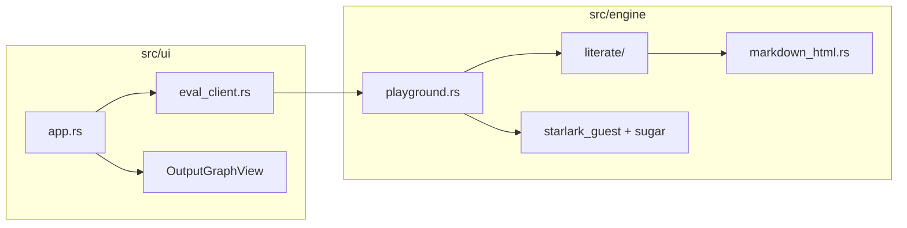

# Architecture Decision Document — Literate `.dice` (Dice Playground)

Single source of truth for transforming the playground from **IDE + split docs** to **literate single-file `.dice`** with **tangle → eval → weave**, shared across **WASM**, **CLI**, and **static docs**.

---

## Project Context Analysis

### Requirements overview

**Functional (from product brief):**

- Single **markdown-first `.dice`** file: prose + ` ```dice ` fenced Starlark.
- **One-shot Run**: whole document eval (no per-cell execution).
- **Inline report**: woven HTML + outputs (text, tables, charts; images later).
- **Tutorial/cookbook** are literate `.dice` sources—**eval as-is**; docs site = **woven HTML** at build time.
- **Legacy** pure-Starlark scripts (no literate markers) keep working.
- CLI: `dice eval`, new **`dice render`**; LSP eventually source-map aware.

**Non-functional:**

- **Exact probability** unchanged (PMF engine, no sampling).
- **Engine/UI separation** — no Leptos in `src/engine/`.
- **Static deploy** — no app server; WASM + CDN/Workers.
- **Wasm bundle** — track size (`docs/wasm-bundle-size.md`); pulldown-cmark already on wasm32.
- **Security** — sanitize user-authored markdown HTML before browser DOM.
- **DoS guards** — extend size/output limits appropriately for literate docs.

**Scale & complexity:**

- Primary domain: **full-stack static** (Rust engine + Leptos WASM + shell docs build).
- Complexity: **medium** — new document pipeline + UI mode + content migration; math engine stable.
- Estimated new engine surface: **`src/engine/literate/`** (~5–8 modules), UI report view, CLI subcommand, build script hooks.

### Technical constraints & dependencies

| Constraint | Source |
|------------|--------|
| Starlark 0.14 guest, dice desugar | Existing `src/engine/` |
| Playground API | `playground.rs`, `eval_client.rs` |
| `MAX_SOURCE_BYTES` 64 KiB | May need literate-specific cap |
| Pandoc today for `docs/**/*.md` | Phased out per migration plan |
| MIT, single crate | `Cargo.toml`, `docs/AGENT.md` |

### Cross-cutting concerns

- **Source maps** — tangled Starlark line ↔ `.dice` line (check, eval, LSP).
- **Output binding** — `OutputEntry` order/names → weave slots.
- **Mode detection** — literate vs legacy in one entry API.
- **Graph/chart embedding** — engine emits structured data; UI mounts `OutputGraphView` at slots (avoid Leptos in engine).
- **Three consumers, one implementation** — WASM, CLI, `build-tutorial-site.sh`.

---

## Starter Template Evaluation

**Decision:** **Brownfield — no new starter.** Continue **single Rust crate** `dice-playground` with existing layout:

- `src/engine/` — probability + Starlark + playground API + **new `literates/`**
- `src/ui/` — Leptos CSR WASM
- `src/bin/dice.rs` — CLI (feature `cli`)

Stack locked by repo: **Rust 2021**, **Leptos 0.8 CSR**, **Starlark 0.14**, **Trunk** + **Wrangler** static deploy.

---

## Core Architectural Decisions

### Decision priority

**Critical (block implementation):**

| ID | Decision | Rationale |
|----|----------|-----------|
| D1 | **Literate format** = markdown prose + executable fences: bare **` ``` `** or **` ```dice `** (v1) | Matches brief, research, author familiarity |
| D2 | **Pipeline** = parse → tangle → desugar → eval → weave | One-shot; eval unchanged |
| D3 | **Literate detection** = ≥1 executable fence: empty info string (defaults to dice) or info string exactly **`dice`** (case-sensitive) | Bare fences match Quarto/notebook habit; other tags stay prose-only |
| D4 | **Weave library** = **`pulldown-cmark` 0.13** (`html` feature) via `markdown_to_html` | Proven on wasm32 (spike) |
| D5 | **HTML sanitization** = **`ammonia`** (or equivalent) in **engine** before UI | User-controlled markdown |
| D6 | **Legacy path** = if not literate, current `eval_program` / `check_source` behavior | Backward compatibility |
| D7 | **Public orchestration API** in `playground.rs`: `eval_document(path, source, opts) -> EvalDocumentResponse` with `{ legacy \| literate }` internally | Single WASM/CLI entry |

**Important:**

| ID | Decision | Rationale |
|----|----------|-----------|
| D8 | **Output binding v1** = render each `output()` **below its fence** in document order | No placeholder syntax required for MVP |
| D9 | **Output binding v1.1** = `{{output "name"}}` in prose (deferred) | Layout control |
| D10 | **`dice render`** writes HTML shell + `tutorial.css` link | Static docs |
| D11 | **Literate size limit** = **256 KiB** document (separate const); keep stricter tangled-only limit if needed | Prose + code |
| D12 | **Graphs in weave** = HTML placeholder `data-dice-output="name"` + JSON payload attribute OR parallel map in response for UI hydration | Keeps chartistry in UI |

**Deferred:**

- YAML front matter on `.dice`
- Full Pandoc markdown subset (callouts, math)
- Per-fence hidden echo
- Collaborative editing / accounts

### API & communication

- **No HTTP API** — in-process calls only (WASM bindings, CLI).
- **`EvalDocumentResponse`** (serde for WASM): `{ diagnostics, report_html?, text?, json?, outputs, mode: legacy|literate }`.
- **CLI:** `dice eval` and `dice render` call same `eval_document` / `render_document` engine functions.

### Frontend architecture

- **Literate mode UI:** source editor + **report pane** (sanitized `inner_html` or isolated container); hide legacy bottom tabs when `mode == literate`.
- **Legacy mode UI:** unchanged (text/json/graph).
- **State:** one-shot Run; no reactive cells.

### Security

- Sanitize **all** weave HTML in engine.
- Do not use `dangerously_set_inner_html` without sanitize pass (Leptos: only trusted engine output).
- CLI render: static files only; no user upload server.

### Infrastructure & deployment

- Unchanged: `make release-static`, Cloudflare Workers, `bin/build-tutorial-site.sh` evolves to invoke **`dice render`** for `.dice` lessons.
- CI: `cargo test`, `make check-wasm`, literate fixtures + eval all `docs/**/*.dice` (post-migration).

---

## Implementation Patterns & Consistency Rules

### Module layout (engine)

```
src/engine/
  literate/
    mod.rs          # pub API: parse, tangle, weave, is_literate
    parse.rs        # fence scanner / document AST
    tangle.rs       # Starlark string + LineMap
    weave.rs        # HTML fragment + output slots
    line_map.rs     # map diagnostic lines
  markdown_html.rs  # markdown_to_html (existing)
  playground.rs     # eval_document orchestration
```

**Rules for agents:**

- Do **not** import `web_sys`, `leptos`, or UI types into `literate/` or `markdown_html.rs`.
- All new public engine items: **`///` docs + runnable example**; no `unwrap`/`expect`.
- Errors: **`anyhow::Context`** with path and phase (`tangle`, `weave`, `eval`).
- Tests: `#[cfg(test)]` in module + `tests/literate_*.rs` integration fixtures under `tests/fixtures/literate/`.

### Literate file conventions

- Executable fence opener: bare ` ``` ` or ` ```dice ` (optional newline); closer: ` ``` ` on its own line. Empty info string = dice.
- Multiple fences → **one Starlark module** (concatenate in source order with `\n` between).
- Tangle inserts `# line N` comments optional **only if** Starlark parser accepts—prefer **external LineMap** only (no comment injection) unless LSP requires otherwise.

### Naming

- Rust: `snake_case` modules; types `LiterateDocument`, `LineMap`, `WeaveResult`.
- CLI: subcommand `render` with `-o` / `--output`.

### Diagnostics

- Always map **tangled** diagnostic lines to **source** lines for literate files before returning to UI/LSP.
- Parse errors (unclosed fence) report **document** line.

---

## Project Structure & Boundaries

### Requirement → component map

| Requirement | Component |
|-------------|-----------|
| Tangle + parse | `engine/literate/parse.rs`, `tangle.rs` |
| Eval | existing `eval_source`, `playground::eval_program` |
| Weave + sanitize | `engine/literate/weave.rs`, `markdown_html.rs`, `ammonia` |
| Playground Run | `ui/eval_client.rs`, `ui/app.rs`, optional `ui/report_view.rs` |
| Static docs | `src/bin/dice.rs` `render`, `bin/build-tutorial-site.sh` |
| Content | `docs/tutorial/*.dice`, `docs/cookbook/*.dice` (target) |
| CI | `tests/tutorial_samples.rs`, `tests/literate_*.rs`, `tests/wasm_eval_smoke.rs` |

### Boundary diagram



**Forbidden:** `engine` → `ui`. **Allowed:** `ui` → `engine` only.

### Target content layout (post-migration)

```
docs/
  tutorial/
    01-one-die.dice      # literate; replaces .md + examples copy
  cookbook/
    *.dice
  README.md              # index/navigation (may stay md short-term)
examples/tutorial/       # deprecated after migration
```

---

## Architecture Validation

### Coherence

- Decisions D1–D7 align with brief and migration plan Phase 1–2.
- pulldown-cmark + ammonia both wasm-compatible (verify ammonia on wasm32 when added).
- Legacy path prevents breaking existing users and CI during rollout.

### Requirements coverage

| Brief requirement | Architecture |
|-------------------|--------------|
| Single file literate | D1, parse/tangle |
| One-shot Run | D2, no cell API |
| WASM weave | D4, D7 |
| Tutorial as `.dice` | content layout + `dice render` |
| No Pandoc in browser | weave in engine; Pandoc phased from build |
| Spike markdown | D4 satisfied |

### Gaps / follow-up

- Formal **PRD** optional; run `bmad-prd` if stakeholder sign-off needed.
- **`bmad-spec`**: companion `literate-dice-format.md` in `_bmad-output/specs/spec-literate-dice/` (done).
- **Release wasm size** after ammonia + weave land.
- **LSP** source map design doc when Phase 6 starts.

### Implementation sequence (aligns with migration plan)

1. `engine/literate` parse + tangle + line map + tests  
2. `eval_document` + legacy branch  
3. weave MVP + ammonia + `dice render`  
4. Playground report UI  
5. Pilot lesson 1 `.dice` + dual build  
6. Bulk content migration + remove Pandoc for lessons  
7. LSP + llms.txt update  

---

## Handoff

This architecture is ready for **`bmad-spec`** (format contract) and **`bmad-create-epics-and-stories`** / **`bmad-quick-dev`** (Phase 1 spec).

**Primary artifact paths:**

- Planning: `_bmad-output/planning-artifacts/architecture.md` (this file)
- Migration phases: `_bmad-output/planning-artifacts/literate-dice-migration-plan-2026-06-12.md`
- Brief: `_bmad-output/planning-artifacts/briefs/brief-dice-playground-2026-06-12/`
