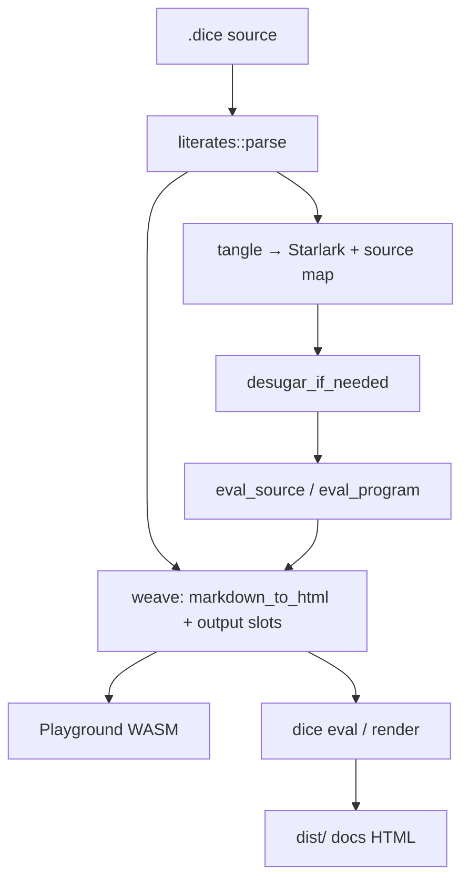

# Migration plan: current implementation → literate `.dice`

This plan moves Dice Playground from **IDE + split docs/scripts** to **single-file literate `.dice`**, **one-shot Run**, **inline report** (WASM + CLI + static docs), without breaking exact eval or CI along the way.

## Current state (baseline)

| Area | Today |
|------|--------|
| **Playground** | `src/ui/app.rs`: file drawer, monospace editor, diagnostics + **text/json/graph panel below** |
| **Eval API** | `playground::eval_program` → full source string → `desugar_if_needed` → Starlark (`MAX_SOURCE_BYTES` 64 KiB) |
| **Tutorial** | `docs/tutorial/*.md` → **Pandoc** in `bin/build-tutorial-site.sh` |
| **Runnable scripts** | `examples/tutorial/*.dice` (duplicate logic); CI `tests/tutorial_samples.rs` |
| **Cookbook** | `docs/cookbook/*.md` + Pandoc |
| **Playground links** | `dice enhance-static-site` injects “load in playground” from HTML code blocks |
| **Weave spike** | `engine::markdown_to_html` (`pulldown-cmark`), wasm32 check passes |

## Target state (north star)

| Area | Target |
|------|--------|
| **Artifact** | One **markdown-first `.dice`** file: prose + ` ```dice ` fences |
| **Pipeline** | **Tangle** → **eval** (unchanged math) → **weave** (md→HTML + inline outputs) |
| **Playground** | Edit source (or split view); **Run** refreshes **report** (sanitized HTML + charts), not a detached terminal |
| **Tutorial/cookbook** | Same **`.dice` files** under `docs/` (or consolidated tree); **eval + CI** on file; **site = woven HTML** at build time |
| **CLI** | `dice eval` / **`dice render`** use same engine module as WASM |
| **Legacy** | Pure Starlark files with **no literate markers** keep working (compatibility mode) |

## Guiding principles

1. **Engine owns literate logic** — `src/engine/literate/` (or similar); UI only displays sanitized HTML and charts.
2. **One implementation, three consumers** — playground WASM, native CLI, `make release-static`.
3. **Migrate content incrementally** — pilot one lesson before bulk-converting 13 tutorials + cookbook.
4. **Keep CI green** — each phase adds tests before removing old paths.
5. **Measure wasm** — after phases touching weave/render, run `make release-static` and compare to `docs/wasm-bundle-size.md`.

## Architecture (target pipeline)



## Phases

Phases are ordered by **dependency**. Later phases can start in parallel once Phase 1–2 APIs exist (e.g. content migration after pilot API).

### Phase 0 — Markdown weave primitive ✅ (done)

| Deliverable | Status |
|-------------|--------|
| `pulldown-cmark` + `markdown_to_html` | Done |
| `make check-wasm`, unit + smoke tests | Done |

**Exit:** Spike spec `spec-wasm-markdown-html-spike.md` complete.

---

### Phase 1 — Literate document model + tangle

**Goal:** Parse literate `.dice`, extract fenced code, eval tangled Starlark; legacy files unchanged.

| Work | Details |
|------|---------|
| **`engine/literate/`** | `parse(source) → LiterateDocument` (prose spans, `dice` fences, optional front matter later) |
| **Tangle** | Concatenate fence bodies in order; emit **line map** (tangled line → source line) for diagnostics |
| **Detection** | Literate if fenced `dice` blocks (and/or agreed markers); else **legacy** path (current behavior) |
| **`playground.rs`** | `check_literate` / `eval_literate` (or extend `eval_program` internally) calling tangle then existing check/eval |
| **Limits** | Raise or split **64 KiB** cap for literate documents (prose + code) |
| **Tests** | Golden: one minimal literate file; legacy `examples/tutorial/01-one-die.dice` unchanged |

**Exit criteria:**

- Given a literate fixture with two fences, when `eval_literate`, then both `output()` calls run in one Starlark module.
- Given legacy script, when `eval_program`, then behavior identical to today.
- Diagnostics reference **source** line numbers via map.

**Primary files:** `src/engine/literate/*`, `src/engine/playground.rs`, `tests/literate_*.rs`

---

### Phase 2 — Weave MVP (engine-only report HTML)

**Goal:** Produce an HTML **fragment** for a literate file after eval—not yet full playground UX.

| Work | Details |
|------|---------|
| **Output binding** | v1: append rendered output **below each fence** in document order; v1.1: `{{output name}}` placeholders in prose |
| **Renderers** | Map `OutputEntry` → HTML (tables from existing text formatters; **graphs** may stay JSON/chart data for UI layer initially) |
| **`weave(document, eval_result) -> String`** | Uses `markdown_to_html` on prose segments; skips or styles `dice` fences in preview |
| **Sanitize** | Add **`ammonia`** (or strict allowlist) in engine before any HTML crosses to UI |
| **CLI stub** | `dice render path.dice -o out.html` (native only first) wrapping weave + minimal CSS shell |

**Exit criteria:**

- Given literate fixture + eval, when `weave`, then HTML contains prose headings and at least one output block.
- Sanitizer strips `<script>` from user markdown smoke test.
- `dice render` writes file usable in browser.

**Primary files:** `src/engine/literate/weave.rs`, `src/bin/dice.rs`, `Cargo.toml`

---

### Phase 3 — Playground report UI

**Goal:** Replace “terminal panel below editor” for literate files with **report view**; keep legacy UX until detection says literate.

| Work | Details |
|------|---------|
| **`eval_client`** | Return `report_html` (+ outputs for graph components if needed) |
| **`app.rs`** | Literate mode: show report region (e.g. `inner_html` via sanitized fragment or iframe sandbox); optional **source / preview** toggle |
| **Run** | One shot: tangle → eval → weave (same as CLI) |
| **Graphs** | Reuse `OutputGraphView` embedded at weave slots or second pass in UI |
| **Workspace** | Default new file template literate; files drawer still OK for multi-file |

**Exit criteria:**

- User opens literate sample, Run once, reads inline report without scrolling to detached `pre` panel.
- Legacy `.dice` still shows text/json/graph tabs.

**Primary files:** `src/ui/app.rs`, `src/ui/eval_client.rs`, possibly `src/ui/report_view.rs`

---

### Phase 4 — CLI parity + static site hook

**Goal:** Docs build can call **`dice render`** instead of Pandoc for lesson sources.

| Work | Details |
|------|---------|
| **`dice eval`** | Route literate files through tangle (text/json output modes preserved) |
| **`dice render`** | Full page HTML + link to shared `tutorial.css` (or new report CSS) |
| **`build-tutorial-site.sh`** | Phase 4a: **dual build** (Pandoc md + render one pilot `.dice`); Phase 4b: switch pilot lesson URL |
| **Remove** | `enhance-static-site` playground injection for migrated pages (link becomes “open `.dice` in playground”) |

**Exit criteria:**

- One tutorial lesson served from **rendered `.dice`** in `dist/tutorial/`.
- `make release-static` succeeds.

**Primary files:** `bin/build-tutorial-site.sh`, CLI in `src/bin/dice.rs`, `Makefile`

---

### Phase 5 — Content migration (pilot → full)

**Goal:** Single source of truth per lesson/recipe.

| Step | Action |
|------|--------|
| **5a Pilot** | Convert **lesson 1** (`01-one-die`) to literate `.dice` under `docs/tutorial/`; delete or stop CI-listing duplicate `examples/tutorial/01-one-die.dice` |
| **5b Tutorial** | Convert lessons 2–13; update nav in `docs/README.md` / generated index |
| **5c Cookbook** | Convert recipes; same pattern |
| **5d Cleanup** | Remove Pandoc paths for migrated trees; drop redundant `examples/tutorial/` |
| **5e CI** | `tests/tutorial_samples.rs` → glob literate `.dice` under `docs/`; eval + optional render smoke |

**Exit criteria:**

- No paired `docs/tutorial/foo.md` + `examples/tutorial/foo.dice` for migrated lessons.
- CI evals every lesson `.dice` as-is.

**Primary files:** `docs/tutorial/*`, `docs/cookbook/*`, `tests/tutorial_samples.rs`, `docs/README.md`, `llms.txt`

---

### Phase 6 — LSP, docs, and hardening

| Work | Details |
|------|---------|
| **LSP** | Diagnostics on tangled buffer + source map; syntax highlight literate fences in editor |
| **`llms.txt`** | Literate `.dice` authoring rules |
| **User guide** | README / AGENT.md architecture update |
| **Wasm size** | Release measurement; trim if over budget |
| **`bmad-spec` / architecture doc** | Lock format: fence tag, placeholder syntax, markdown subset |

**Exit criteria:**

- Documented literate format; LSP usable on a literate lesson file.
- Product brief success criteria met for tutorial-as-`.dice` and wasm weave.

---

## Workstream summary

| Workstream | Phases | Owner hint |
|------------|--------|------------|
| Engine literate | 1, 2 | Core / Amelia |
| Playground UI | 3 | UI / Sally+Amelia |
| CLI + deploy | 2, 4 | CLI + infra |
| Content | 5 | Paige + Steve |
| Quality | 1–6 | CI, wasm smoke, tutorial tests |

## Risks and mitigations

| Risk | Mitigation |
|------|------------|
| Wasm bundle growth | Subset markdown; measure each phase; avoid comrak unless needed |
| Graph inline in HTML | Phase 2: UI mounts charts from structured output; don’t embed Leptos in engine |
| 64 KiB limit | Increase cap for literate docs or compress stored workspace |
| Pandoc removal breaks styling | Reuse `tutorial-static/tutorial.css`; wrap render output |
| Long migration | Pilot lesson 1 end-to-end before mass convert |
| LSP complexity | Ship tangle map before literate-aware highlights |

## Suggested “first three sprints” (concrete)

1. **Sprint A — Engine tangle (Phase 1)**  
   Literate parse + tangle + tests; `eval_program` uses it when detected; legacy unchanged.

2. **Sprint B — Weave + render (Phase 2 + start 4)**  
   Weave MVP, sanitize, `dice render`; one golden HTML snapshot test.

3. **Sprint C — Playground report + lesson 1 (Phase 3 + 5a)**  
   Report UI for literate files; convert lesson 1; dual-publish in static site.

After Sprint C, you have a **vertical slice** provable in production; remaining tutorials are **content churn** on a fixed pipeline.

## BMad follow-ons

| When | Skill |
|------|--------|
| Lock format + module boundaries before Phase 1 code freeze | `bmad-create-architecture` |
| Machine contract for fence/placeholder rules | `bmad-spec` |
| Report editor UX (source vs preview) | `bmad-ux` |
| Epic/story breakdown of phases | `bmad-create-epics-and-stories` |

## Definition of done (program level)

- [ ] Literate `.dice` is the only tutorial/cookbook source; CI evals each file.
- [ ] Playground **Run** shows woven report for literate files; legacy scripts still work.
- [ ] `make release-static` builds docs from **`dice render`**, not Pandoc, for migrated corpus.
- [ ] Same engine code paths verified on **wasm32** and native CLI.
- [ ] Brief + architecture/spec updated; wasm size documented post-release.
