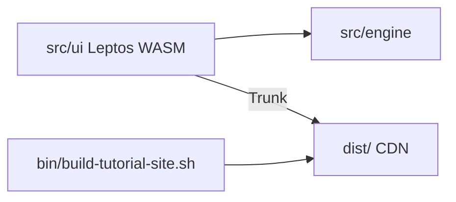

# AI agent brief: Dice Playground (single crate)

## Product

**Dice Playground** — exact probability for tabletop mechanics:

1. **`.dice` scripts** — Starlark + sugar (`2d6`, pools, labeled outcomes).
2. **`dice` CLI** — eval, docs, `table-2d10`, **`dice lsp`** (stdio LSP).
3. **Web playground** — Leptos CSR WASM; check/eval in-browser (`src/ui/eval_client.rs` → `src/engine/playground.rs`).

No runtime server. Ship **`dist/`** to any CDN ([docs/deploy-cdn.md](deploy-cdn.md)) or **Cloudflare Workers** ([docs/deploy-cloudflare.md](deploy-cloudflare.md), `make cf-deploy`).

## Repository layout

```
.
├── Cargo.toml              # package dice-playground
├── Trunk.toml / index.html
├── wrangler.toml / package.json   # Cloudflare Workers deploy
├── Makefile
├── src/
│   ├── lib.rs              # dice_playground; #[macro_use] starlark
│   ├── engine/             # was app-dice-language
│   ├── ui/                 # was app-dice-playground
│   └── bin/
│       ├── dice.rs
│       └── dice-playground.rs
├── docs/                   # user guide: tutorial, cookbook, references
├── docs/tutorial/            # literate `.dice` lessons (CI + `dice render`)
├── docs/cookbook/            # literate `.dice` recipes
├── tutorial-static/        # shared CSS for static docs (`tutorial.css`)
└── bin/build-tutorial-site.sh  # ends with `dice enhance-static-site` (playground ↗ links)
```



## Features (Cargo)

- `cli` — `dice` binary (`clap`, `csv`)
- `lsp` — `starlark_lsp`, `engine::lsp` (default with `cli`)
- **UI** — Leptos **0.8** CSR (`leptos` feature `csr`); playground in `src/ui/`
- WASM builds: `cargo check --target wasm32-unknown-unknown --no-default-features`

## Key paths

| Area | Location |
|------|----------|
| Starlark guest | `src/engine/starlark_guest/` |
| PMF core | `src/engine/core.rs` |
| Playground eval API | `src/engine/playground.rs` |
| Leptos UI | `src/ui/app.rs` |
| User guide | `docs/README.md` — tutorial, cookbook, function reference |
| Tutorial | `docs/tutorial/` (literate `.dice`) |
| Cookbook | `docs/cookbook/` (literate `.dice`) |
| Function reference | `docs/references/` (generated `stdlib.md`) |

## Verification

```bash
make test
make check-wasm
make release-static   # optional: needs trunk (docs HTML via dice render / render-md)
make cf-deploy        # release-static + wrangler (needs npm + wrangler login)
```

## Historical note

Previously extracted as a multi-crate workspace (`app-dice-language`, `app-dice-playground`, Axum server). Consolidated to one crate for CDN-only deploy; server and spike crates removed.
